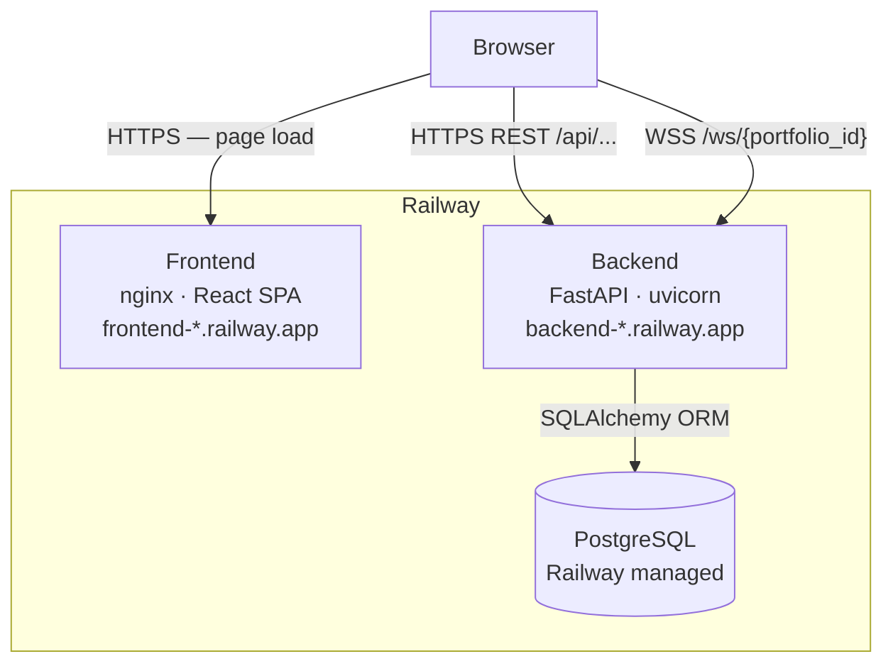
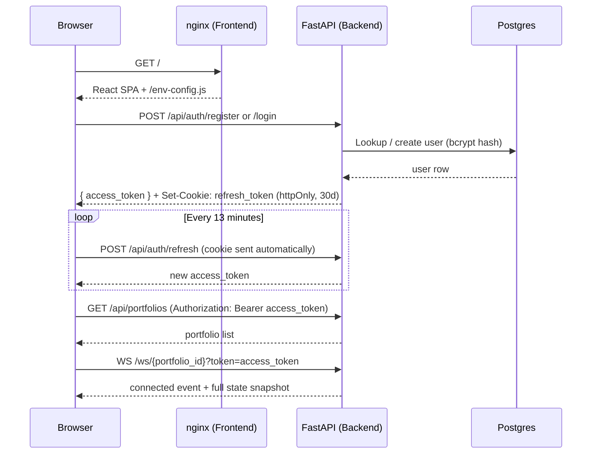
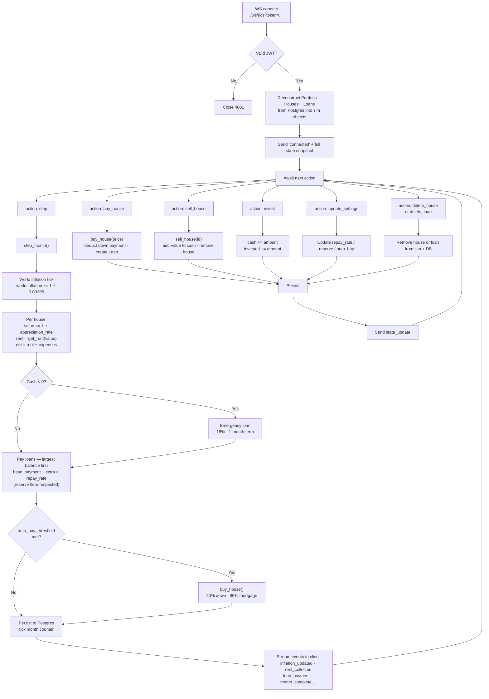
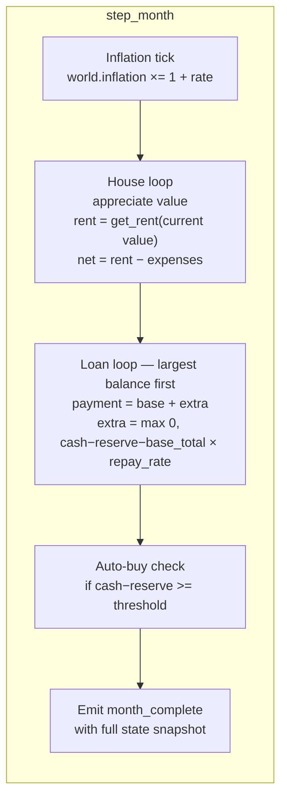
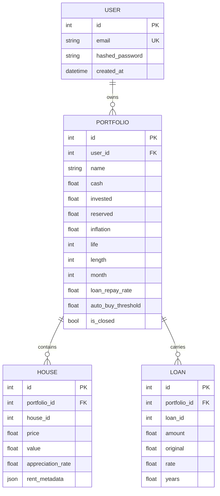

# rentSIM

A real-estate portfolio simulator modelled on the Shenandoah Valley, VA rental market. Create portfolios, inject capital, buy and sell properties, watch loans amortise month by month, and let the sim run forward in time to see how the numbers play out.

**Live:** https://frontend-production-a569.up.railway.app

---

## Features

- Multi-portfolio dashboard with tab switching
- Real-time month-by-month simulation over WebSocket
- Rent estimates sampled from four Shenandoah Valley sub-markets (Woodstock, Strasburg, Front Royal, Winchester)
- Amortising mortgages at 80% LTV with configurable extra repayment
- Floating `+$` / `-$` event notifications per rent collection and loan payment
- Auto-step at configurable speed (0.5 s → 5 s per month)
- Auto-buy trigger: automatically purchase when cash reaches a set threshold
- JWT auth — 15-minute access tokens, 30-day httpOnly refresh cookies
- Fully persistent across sessions (Postgres-backed)

---

## System Architecture



The frontend is a static React/Vite build served by nginx. On startup the container runs `env.sh`, which writes `env-config.js` into the served directory so that `VITE_API_URL` / `VITE_WS_URL` are injected at runtime without a rebuild. All simulation state lives in Postgres; in-memory sim objects are reconstructed per WebSocket connection.

---

## Authentication Flow



---

## Simulation Loop

Each portfolio has a dedicated WebSocket connection. The client sends action messages; the server runs them against an in-memory `Portfolio` object, persists the result to Postgres, and streams events back to the client.



---

## Monthly Step — Detail



---

## Data Model



---

## Tech Stack

| Layer | Technology |
|---|---|
| Frontend | React 18 · Vite · Tailwind CSS · React Router |
| Real-time | Browser WebSocket API · FastAPI WebSocket |
| Backend | FastAPI · uvicorn · SQLAlchemy 2 |
| Auth | python-jose (JWT) · bcrypt 4 · httpOnly refresh cookies |
| Database | PostgreSQL (Railway managed) |
| Serving | nginx — SPA routing + runtime env injection via `envsubst` |
| Deployment | Railway — 3 services: frontend, backend, Postgres |
| Rent model | Custom Shenandoah Valley estimator (4 sub-markets, bedroom distribution) |

---

## Project Structure

```
rentSIM/
├── backend/
│   ├── api/
│   │   ├── auth.py            # register / login / refresh / logout
│   │   ├── portfolios.py      # CRUD + available-houses generator
│   │   └── ws.py              # WebSocket endpoint + DB↔sim conversion
│   ├── sim/
│   │   ├── world.py           # cumulative inflation accumulator
│   │   ├── house.py           # per-house appreciation + rent sampling
│   │   ├── loan.py            # amortising loan with extra repayment
│   │   ├── portfolio.py       # month step, buy/sell, auto-buy logic
│   │   └── rent_estimator.py  # Shenandoah Valley rent model
│   ├── models.py              # SQLAlchemy ORM models
│   ├── schemas.py             # Pydantic request/response schemas
│   ├── database.py            # engine + session factory
│   ├── auth.py                # JWT encode/decode, bcrypt helpers
│   ├── main.py                # FastAPI app, CORS, router mounts
│   ├── requirements.txt
│   └── Dockerfile
│
└── frontend/
    ├── src/
    │   ├── App.jsx                      # Dashboard, portfolio tabs, routing
    │   ├── pages/
    │   │   ├── Login.jsx
    │   │   └── Register.jsx
    │   ├── components/
    │   │   ├── PortfolioCard.jsx        # 3-column card shell
    │   │   ├── PortfolioControls.jsx    # stats, step/auto, invest, reserve
    │   │   ├── HouseList.jsx            # house cards + buy modal
    │   │   ├── LoanList.jsx             # loan cards + repay-rate slider
    │   │   └── FloatingNotification.jsx
    │   ├── hooks/
    │   │   └── useSimWebSocket.js       # WS connection + state management
    │   └── context/
    │       └── AuthContext.jsx          # JWT state + silent refresh loop
    ├── nginx.conf.template              # SPA server with PORT substitution
    ├── env.sh                           # runtime env-config.js injection
    └── Dockerfile
```

---

## Rent Model

Houses are priced from a base set ($180 k–$480 k) scaled by the portfolio's cumulative inflation multiplier. Each month, rent is re-sampled from the Shenandoah Valley estimator:

1. A **market** is drawn uniformly from four sub-markets, each with a calibrated gross yield rate and rent floor/ceiling.
2. A **bedroom count** is drawn from a weighted distribution skewed toward 2–4 BR.
3. Base rent = `property_value × gross_yield / 12`, clamped to floor/ceiling, then scaled by a bedroom multiplier.

Monthly expenses (property tax + insurance + maintenance) are computed as **2.28% of current value annualised** and deducted from gross rent to produce net cash flow.

| Market | Gross yield | Rent floor | Rent ceiling |
|---|---|---|---|
| Woodstock, VA | 5.60% | $900 | $3,200 |
| Strasburg, VA | 5.20% | $850 | $2,800 |
| Front Royal, VA | 6.00% | $950 | $3,500 |
| Winchester, VA | 4.70% | $950 | $3,800 |

---

## Local Development

```bash
# Backend
cd backend
python -m venv .venv && source .venv/bin/activate
pip install -r requirements.txt
DATABASE_URL=postgresql://localhost/rentsim \
SECRET_KEY=dev-secret \
ALLOWED_ORIGINS=http://localhost:5173 \
uvicorn main:app --reload

# Frontend (separate terminal)
cd frontend
npm install
VITE_API_URL=http://localhost:8000 \
VITE_WS_URL=ws://localhost:8000 \
npm run dev
```

---

## Railway Deployment

Three services in one Railway project:

| Service | Source | Public URL |
|---|---|---|
| `frontend` | `frontend/Dockerfile` | Yes |
| `backend` | `backend/Dockerfile` | Yes |
| `Postgres` | Railway template | No |

**backend environment variables**

```
DATABASE_URL      # injected automatically by the Railway Postgres plugin
SECRET_KEY        # random string for JWT signing
ALLOWED_ORIGINS   # comma-separated frontend origins, e.g. https://frontend-*.up.railway.app
PORT              # 8000
```

**frontend environment variables**

```
VITE_API_URL   # https://backend-production-*.up.railway.app
VITE_WS_URL    # wss://backend-production-*.up.railway.app
PORT           # 80
```

Deployments trigger automatically on push to `main`.
